<!-- README.md is generated from README.Rmd. Please edit that file -->

# AFKAR 🩺💻

AFKAR (Algorithmic Framework for Knowledge Augmentation in R) is a
machine learning and statistical framework specifically designed for
modern clinical research, hospital management (Business Process
Reengineering), and Precision Medicine.

Bypassing heavy third-party packages, AFKAR provides high-performance,
mathematically rigorous algorithms that output publication-ready 4K
clinical dashboards suitable for top-tier medical journals (e.g.,
Lancet, NEJM).

# ✨ Key Features:

Strict Clinical Boundary Checks: Automatically fades (grays out)
Non-Significant variables when Odds Ratio (OR), Hazard Ratio (HR), or
Effect Sizes cross the null boundary (1.0 or 0.0).

Pillar-Aligned Forest Plots: Ensures extreme variables or long clinical
names never overlap with Confidence Intervals in output plots.

Clinical Accountability (XAI): Generates explainable Tornado and
Waterfall charts for individual patients, preventing black-box
malpractice.

Cost-Effective Diagnostics: Native BIC-Driven Feature Selection to
isolate Elite Biomarkers and minimize laboratory costs.

# 👥 Authors / Contributors

- **Muhammad Almanfaluthi** - *Creator & Lead Developer* -
  [Almanfaluthi](https://github.com/Almanfaluthi) - Department of
  Tropical Medicine and Parasitology, Faculty of Medicine, Universitas
  Muhammadiyah Purwokerto, Central Java, Indonesia
- **Khusnul Fathoni Effendy** - *Methodology & Co-Author* - Faculty of
  Medicine, Brawijaya University, East Java, Indonesia
- **Satini Yuniarsih** - *Methodology & Co-Author* - Muslim Kaffah
  Foundation, East Java, Indonesia
- **Stefani Widodo** - *Methodology & Co-Author* - Department of Public
  Health, Faculty of Medicine, Universitas Muhammadiyah Purwokerto,
  Central Java, Indonesia
- **Zuhrotun Ulya** - *Methodology & Co-Author* - Faculty of Medicine,
  Brawijaya University, East Java, Indonesia
- **Shalahuddin Maulidi** - *Methodology & Co-Author* - Lembaga
  Kesehatan Gigi dan Mulut Pusat Kesehatan TNI Angkatan Darat
  (Indonesian Army)
- **Rara Tarika** - *Methodology & Co-Author* - Lembaga Kesehatan Gigi
  dan Mulut Pusat Kesehatan TNI Angkatan Darat (Indonesian Army)
- **Abidah Safitri** - *Methodology & Co-Author* - Muslim Kaffah
  Foundation, East Java, Indonesia

# 🚀 Installation

You can install the development version of AFKAR like so: 1. install
[R](https://www.r-project.org/) 2. install
[R-studio](https://posit.co/downloads) 3. install
[Rtools](https://cran.r-project.org/bin/windows/Rtools/) \#windows

# install.packages(“devtools”)

devtools::install_github(“Almanfaluthi/AFKAR”)

\#🛠️ Architecture & Modules (Un-Supervised Clinical AI)

A1_unsupervised_cluster(): Clinical Clustering

A2_unsupervised_anomaly(): Anomaly detection and Fraud Analysis

A3_unsupervised_reduction(): Dimentionalty reduction to counter
multicollinearity

A4_unsupervised_association(): Association unsupervised analysis

A5_unsupervised_textmining(): Text mining for Topic determination

A6_unsupervised_network(): Network Analysis

A7_unsupervised_timeseries(): Time series detection

\#🛠️ Architecture & Modules (Supervised Clinical AI)

B1_supervised_screening(): High-Sensitivity Diagnostic Triage.

B2_supervised_triage(): Multi-Class Severity Scoring.

B3_supervised_rare(): Imbalanced Event Handler (SMOTE-Lite for Rare
Diseases).

B4_supervised_los(): Exact Length of Stay (LoS) Forecaster for
BPJS/Hospital BPR.

B5_supervised_survival(): Time-to-Event Survival Engine (Kaplan-Meier &
Cox).

B6_supervised_precision(): Pharmacogenomics & Precision Dosage
Predictor.

B7_supervised_consensus(): Automated Ensemble Benchmark
(Multidisciplinary AI Board).

B8_supervised_biomarker(): Native BIC-Driven Feature Selection
(Cost-Effective Diagnostics).

B9_supervised_explain(): Explainable AI (XAI) / Local Patient SHAP
Alternative.

📖 Example This is a basic example which shows you how to deploy AFKAR’s
Clinical Machine Learning modules:

``` r
library(AFKAR)

# B3: Imbalanced Rare Event Handler (SMOTE-Lite)
# Handles fatal rare diseases (<5% prevalence) using native synthetic oversampling.
B3_supervised_rare(df_B3, target_var = "anaphylaxis", method = "SMOTE", save_plot = TRUE)
```

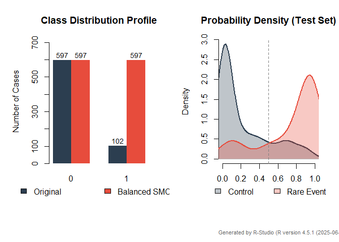

    #> Saved: B3_Topology_20261005_070155_.png

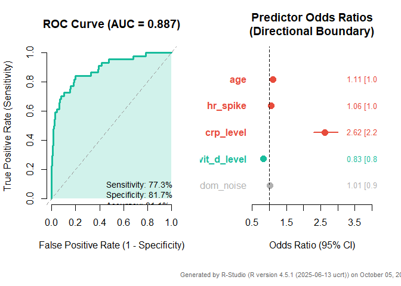

    #> Saved: B3_Diagnostics_20261005_070155_.png

    # B4: Length of Stay (LoS) Forecaster for Hospital BPR
    # Predicts exact days a patient will stay, optimizing bed management.
    B4_supervised_los(df_B4, target_var = "los_days", save_plot = TRUE)

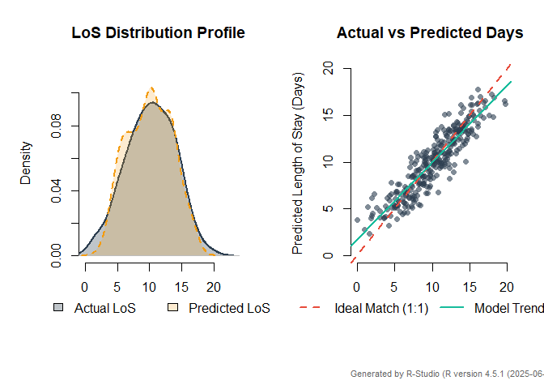

    #> Saved: B4_Topology_20261005_070157_.png

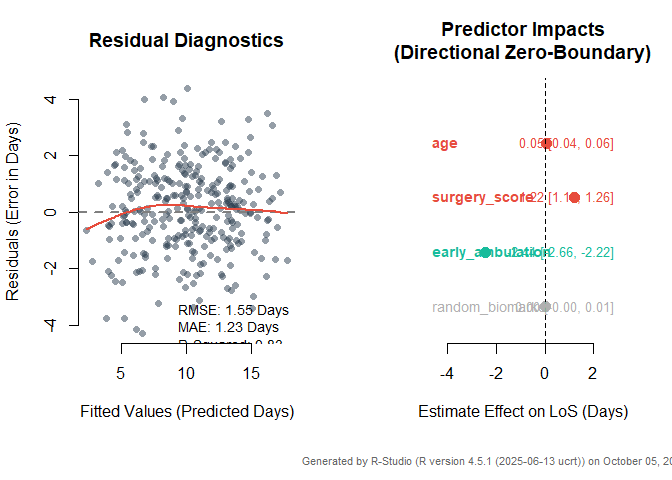

    #> Saved: B4_Diagnostics_20261005_070157_.png

    # B5: Time-to-Event Survival Engine (Kaplan-Meier & Log-Hazard)
    # Predicts exact time-to-relapse for chronic/oncology patients.
    B5_supervised_survival(df_B5, time_var = "time_to_relapse", status_var = "relapse_status", save_plot = TRUE)

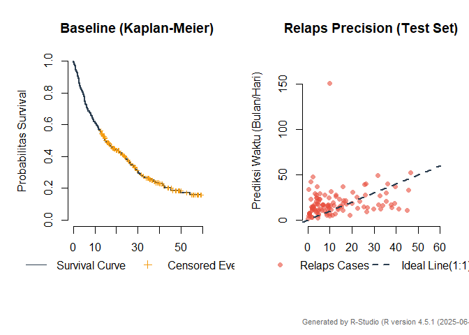

    #> Saved: B5_Topology_20261005_070158_.png

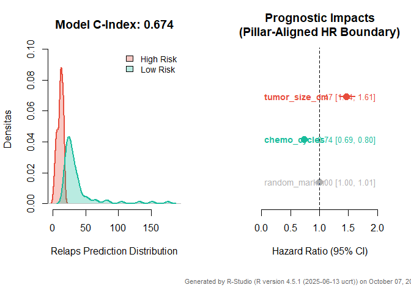

    #> Saved: B5_Diagnostics_20261005_070158_.png

    # B6: Pharmacogenomics Precision Dosage Predictor
    # Calculates exact personalized drug dosage (e.g., Warfarin) with absolute zero failsafe.
    B6_supervised_precision(df_B6, target_var = "weekly_dose_mg", save_plot = TRUE)

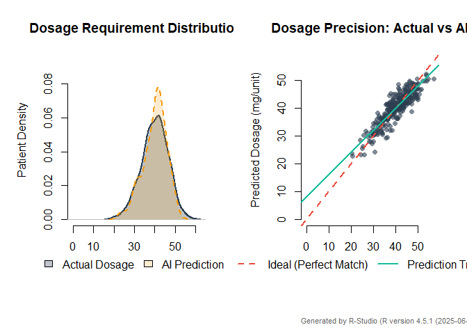

    #> Saved: B6_Topology_20261005_070159_.png

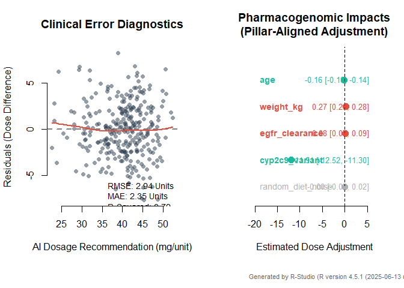

    #> Saved: B6_Diagnostics_20261005_070159_.png

    # B7: Automated Ensemble Benchmark (Multi-Algorithm Consensus)
    # Deploys 5 algorithms simultaneously and creates a Super Model via Majority Voting.
    B7_supervised_consensus(df_B7, target_var = "sepsis_status", save_plot = TRUE)

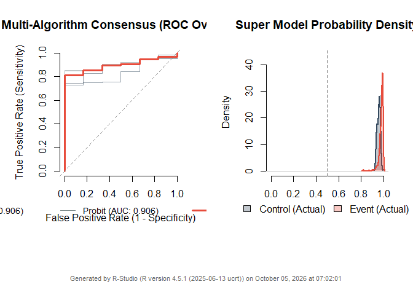

    #> Saved: B7_Topology_20261005_070201_.png

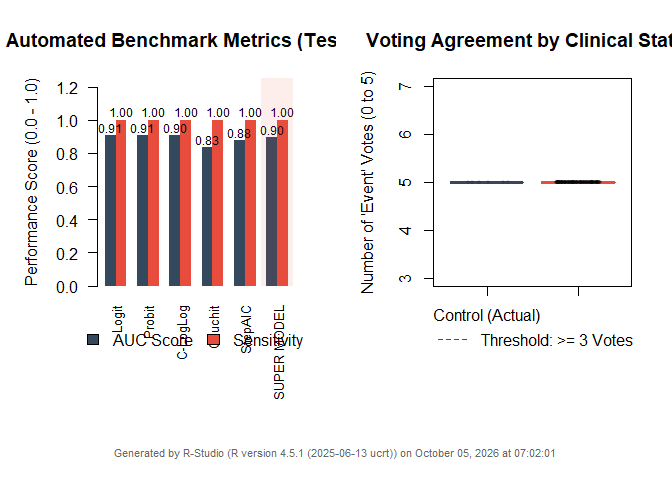

    #> Saved: B7_Diagnostics_20261005_070201_.png

    # B8: Native BIC-Driven Feature Selection (Elite Biomarkers)
    # Recursively eliminates noise to find the top 3 most cost-effective diagnostic lab tests.
    B8_supervised_biomarker(df_B8, target_var = "disease_status", max_features = 3, save_plot = TRUE)

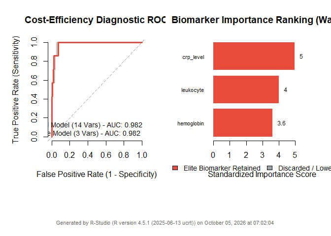

    #> Saved: B8_Topology_20261005_070204_.png

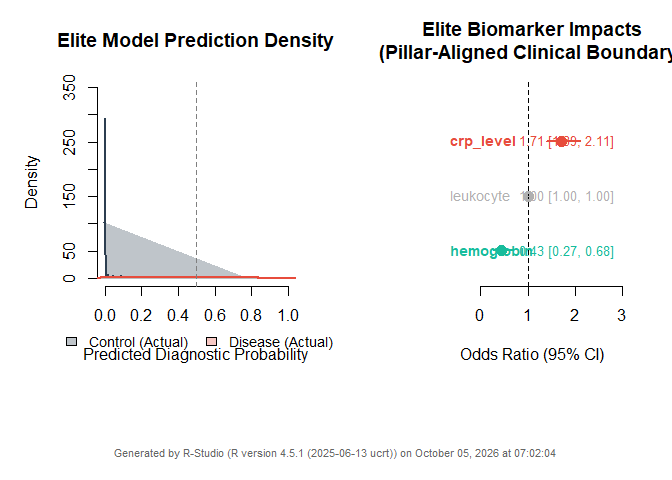

    #> Saved: B8_Diagnostics_20261005_070204_.png

    # B9: Explainable AI (XAI) / Local Patient SHAP Alternative
    # Opens the black box: Explains exactly WHY a specific patient is predicted to have a fatal event.
    B9_supervised_explain(df_B9, target_var = "shock_event", patient_index = 1, save_plot = TRUE)

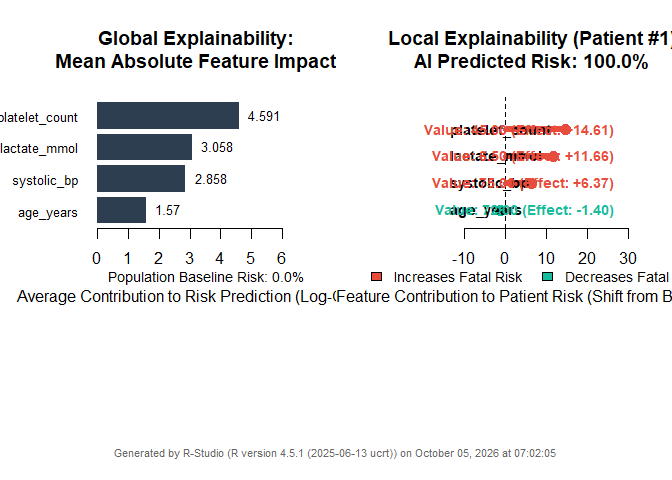

    #> Saved Plot 1: B9_Plot1_Explainability_20261005_070205_.png

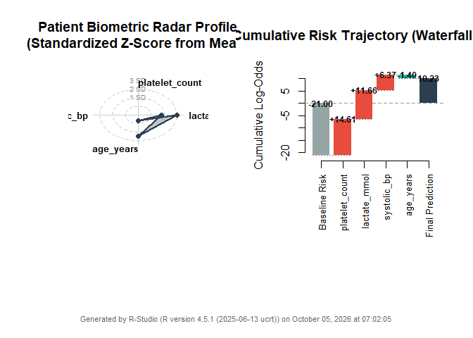

    #> Saved Plot 2: B9_Plot2_ClinicalProfile_20261005_070205_.png

🤝 Contributing Contributions, issues, and feature requests are welcome!
Feel free to check the issues page. If you are using AFKAR for your
dissertation, clinical trials, or hospital management projects, we’d
love to hear your feedback.

📝 License This project is licensed under the MIT License - see the
LICENSE.md file for details.
